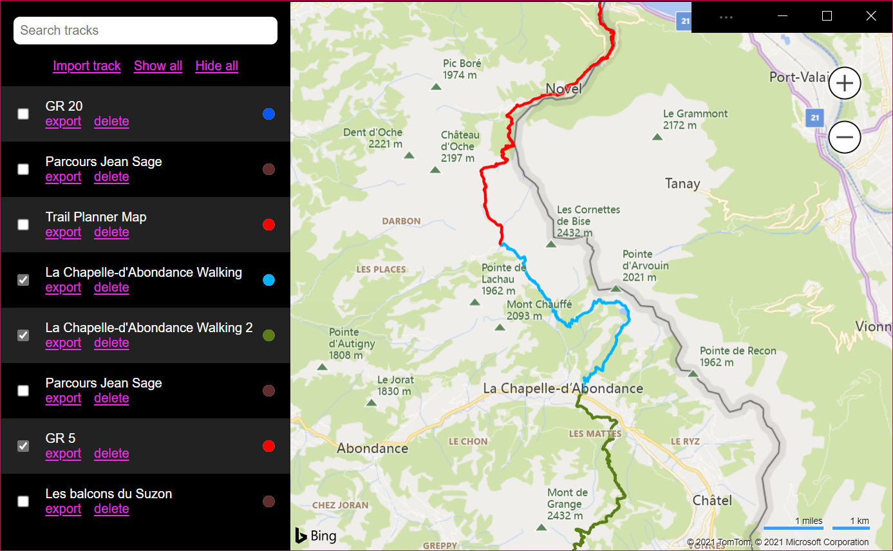

# *My Tracks* demo PWA app

This is a sample application that demonstrates various PWA features.

## Enable some features first

Most of the PWA features demonstrated here are still experimental, so before using the app, you will need to use a browser that support the features: Edge or Chrome at this point, and then enable some flags in `about://flags`

* `#file-handling-api`
* `#enable-desktop-pwas-protocol-handling`
* `#enable-desktop-pwas-window-controls-overlay`
* `#enable-desktop-pwas-url-handling`

The app will work on any other browser and without these flags, you just won't have access to all of the demonstrated features.

## App features

### What the app does

The application shows a map and gives users the ability to import GPS track data (from GPX files). Tracks can be imported by either opening a GPX file from the OS, or by using the "import" button at the top.

Tracks are displayed in a list on the side and can be toggled on the map.

Tracks can also be exported as GPX files again, or deleted.

The color of each track can be changed independently.

Tracks are only stored locally (using IndexedDB).

### What PWA desktop features are demonstrated

* **[Windows control overlay](https://docs.microsoft.com/en-us/microsoft-edge/progressive-web-apps-chromium/experimental-features/#window-controls-overlay-for-installed-desktop-web-apps)**
  * This allows the app, once installed, to use the OS title bar to display a logo and a button to import new tracks
* **[URL protocol handler](https://docs.microsoft.com/en-us/microsoft-edge/progressive-web-apps-chromium/experimental-features/#uri-protocol-handling)**
  * This allows the app to handle the `geo` protocol by opening up when a URL such as [geo:42.37974557295966,8.945581957388745](geo:42.37974557295966,8.945581957388745) is navigated to.
* **[Shortcuts](https://docs.microsoft.com/en-us/microsoft-edge/progressive-web-apps-chromium/experimental-features/#shortcuts)**
  * This adds the "show all tracks" and "hide all tracks" tasks to the app contextual menu.
* **[File handling](https://docs.microsoft.com/en-us/microsoft-edge/progressive-web-apps-chromium/experimental-features/#file-handling)**
  * This registers the app as a handler of `GPX` files. When a GPX files is opened, the app handles it and imports the GPS data as a new track in its local storage.
* **[Run on OS Login](https://docs.microsoft.com/en-us/microsoft-edge/progressive-web-apps-chromium/experimental-features/#run-on-os-login)**
  * This feature is not demonstrated by the app itself. To try this, go to [edge://apps](edge://apps), right-click on the application and select "Start app when you sign in".
* **[URL handler](https://docs.microsoft.com/en-us/microsoft-edge/progressive-web-apps-chromium/experimental-features/#url-link-handling)**
  * **TODO**

### Note on multiple app instances

For now, there isn't a way for desktop PWAs to control how apps are launched (there is [work happening on this topic](https://github.com/alancutter/manifest-incubations/blob/launch-handler/launch_handler-explainer.md)). This is why any action outside of the app that ends up launching it will start a new instance instead of reusing an already opened one.

## Build the app locally

* `npm install`
* `npx webpack`

Then, to run the app locally:

* Start an HTTP server in the root directory of this repo, e.g. `python -m http.server`
* Navigate to `localhost:8000/mytracks`

The reason we use a sub-directory locally is because the app is hosted live on a GitHub page, so it uses a sub-directory there too (https://captainbrosset.github.io/mytracks/).